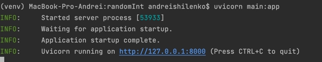

**Инструкция** 
- Необходимо клонировать репозиторий с гитхаба, для этого 
выполнить в терминале `git clone https://github.com/andreyshilenko99/randomInt`
- Далее установим зависимости из файла `requirements.txt` комадой `pip install -r requirements.txt`
- Чтобы запустить сервис необходимо выполнить команду `uvicorn main:app` в терминале
- Должно получиться вот так:
- Переходим по адресу `http://127.0.0.1:8000` в браузере, если у вас ide Pycharm, то можно нажать на ссылку прямо 
  в терминале
- В браузере будет:
